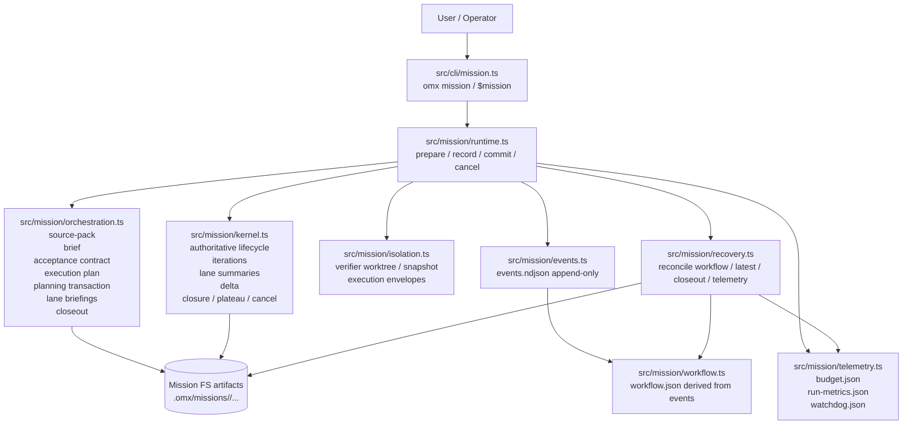
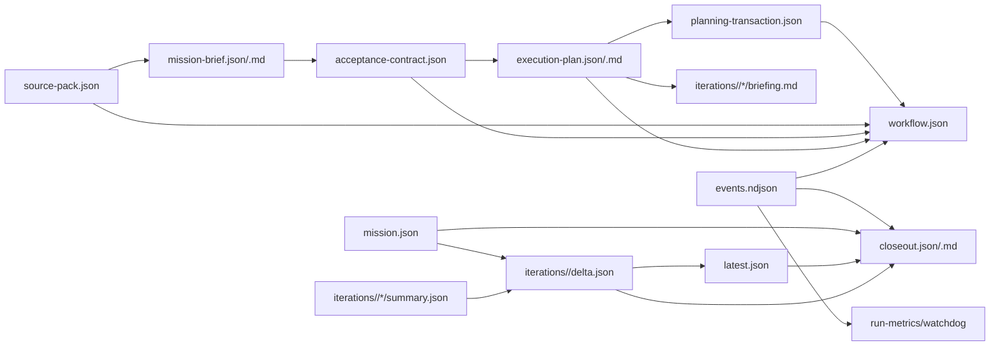
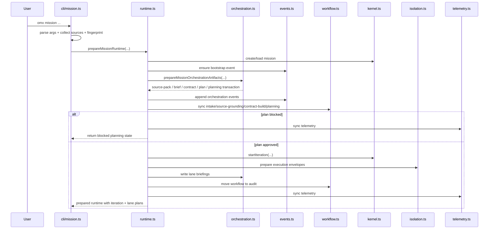
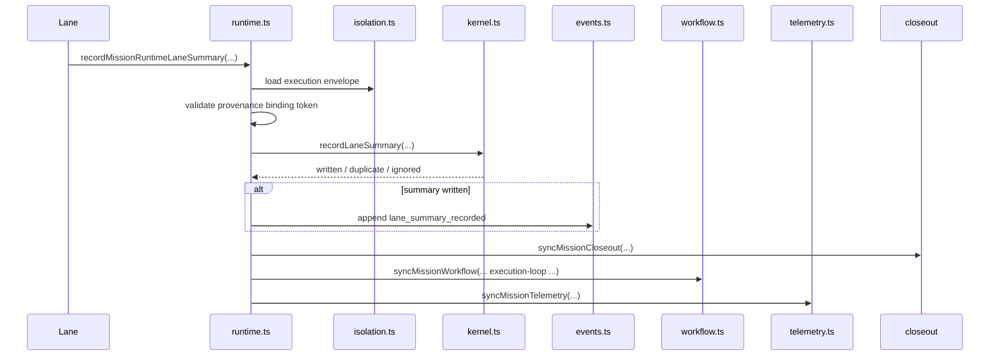
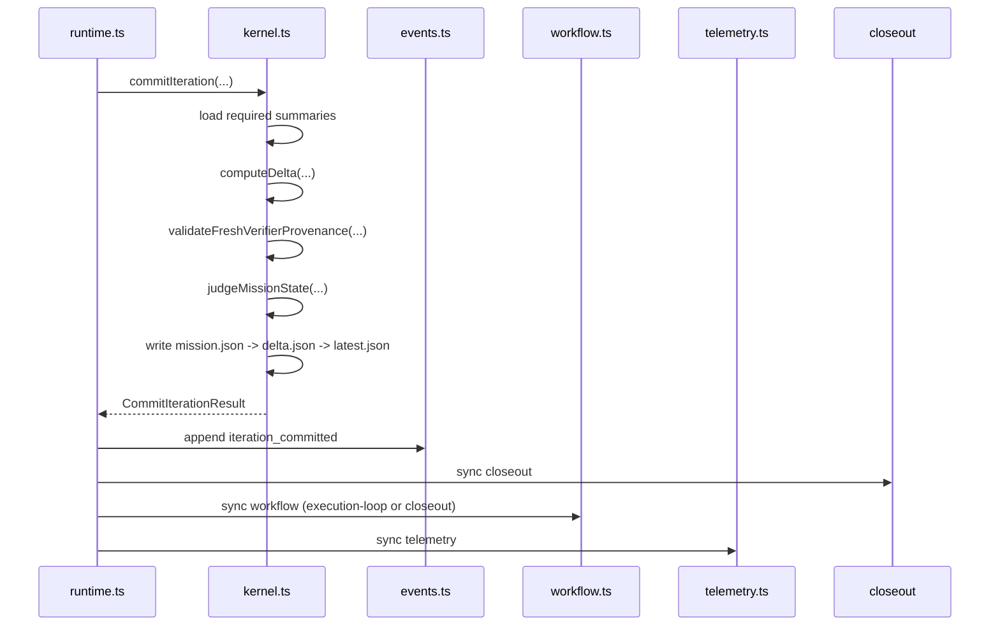
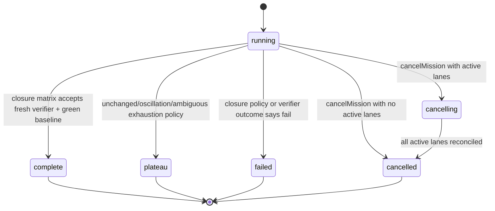

# Mission V2 Architecture Deep Dive

> Current analyzed branch: `mission-v2`
>
> Current analyzed HEAD: `c561806`
>
> Scope of this document: the **current** `mission-v2` branch head, which includes the original Mission V2 rollout **plus** the later hardening program (events, planning transactions, provenance/freshness, telemetry/watchdogs, verifier isolation, recovery hardening).

---

## 1. Executive summary

`mission-v2` in oh-my-codex is a **first-class mission workflow subsystem** layered on top of OMX/Codex.

It is **not** just a prompt, not just a skill, and not just a shell wrapper around a repeated audit loop.

At the current branch head, the system is composed of:

- a **CLI / skill entry surface** that collects mission inputs and starts the mission workflow,
- an **orchestration layer** that builds durable pre-loop artifacts,
- a **runtime bridge** that coordinates artifacts, kernel operations, lanes, workflow, telemetry, and closeout,
- an **authoritative kernel** that owns lifecycle, iteration state, lane-summary semantics, delta semantics, closure, plateau, cancel, and commit ordering,
- an **append-only mission event log**,
- **derived read models** (`workflow.json`, telemetry artifacts, closeout artifacts, `latest.json`) that can be rebuilt,
- **verifier isolation infrastructure** that prevents audit and re-audit lanes from reusing execution provenance,
- **recovery logic** that repairs read models after drift or crash windows.

The central design decision is this:

> **Mission V2 is kernel-first.**
>
> The kernel is authoritative for mission truth. Other layers either:
>
> 1. prepare structured inputs for the kernel,
> 2. emit append-only history, or
> 3. build operator-facing / recoverable read models.

That design makes Mission V2:

- durable,
- replayable,
- safer against false closure,
- more analyzable,
- and much more appropriate for long-running autonomous mission work than the original Mission MVP.

---

## 2. What problem Mission V2 solves

Mission MVP already had a kernel-driven audit loop, but it had a major pre-loop weakness:

- it could start the loop from a task prompt alone,
- it did not have first-class source grounding,
- it did not compile an explicit acceptance/verifier contract before iteration 1,
- it did not have a rich planning transaction model,
- and it did not yet harden verifier freshness/provenance, recovery, and telemetry enough for a long-running autonomous workflow.

Mission V2 fixes that by inserting a **structured pre-loop stack** _before_ the kernel-managed execution loop:

1. **intake**
2. **source grounding**
3. **contract build**
4. **planning**
5. only then **audit → remediation → execution → optional hardening → re-audit → kernel judgment**

So the current Mission V2 is effectively:

- **Mission MVP core semantics**, plus
- **pre-loop grounding/planning**, plus
- **operational hardening for trust, drift recovery, and long-running economics**.

---

## 3. Historical evolution inside `mission-v2`

The current branch is not a single increment. It is a chain.

### Key commit progression from `mission-v1..mission-v2`

| Commit | Theme | Why it matters |
| --- | --- | --- |
| `973cb4d` | Make mission execution honor its closure contract | Closure stops depending on loose local heuristics and becomes contract-driven. |
| `7a207f4` | Ground Mission V2 before the kernel enters iteration 1 | Introduces source grounding, mission brief, acceptance contract, and pre-loop plan gating. |
| `833f6dd` | Make Mission V2 a first-class staged workflow | Adds explicit workflow stages, revisioned artifacts, CLI bootstrap, and runtime staging. |
| `ee49772` | Append-only event trail | Adds `events.ndjson` foundation and reduces dual-truth risk. |
| `0ab3228` | Planning transactions | Makes planning replayable and auditable. |
| `e457a1c` | Replayable source grounding | Strengthens provenance/freshness and repeatability of input sources. |
| `0bc4cad` | Runtime budgets + watchdogs | Adds operational economics/observability. |
| `e4725af` | Verifier isolation | Adds worktree/snapshot-based independent verifier lane foundations. |
| `1e4d1f4` | Read-model recovery | Makes derived mission state repairable after crash windows. |
| `c4c6299` | Recovery + verifier hardening | Preserves authority and isolation semantics across recovery paths. |
| `c561806` | Trustworthy recovery and verifier closure | Tightens final trust boundaries and read-model correctness. |

### Important interpretation

If someone says “Mission V2”, that could mean two different things:

1. **initial V2 rollout** (roughly around `7a207f4` / `833f6dd`), or
2. **current branch head** (`c561806`), which is **V2 plus hardening**.

This document explains the **current branch head**.

---

## 4. High-level architecture in one picture

### ASCII overview

```text
User / Operator
    |
    v
omx mission / $mission
    |
    v
src/cli/mission.ts
    |
    v
src/mission/runtime.ts  <-------------------------------------------+
    |                                                            |
    | prepares / syncs / bridges                                  |
    v                                                            |
+-------------------+        +------------------------------+      |
| orchestration.ts  | -----> | durable mission artifacts    |      |
| source->brief->   |        | source-pack / brief / plan   |      |
| contract->plan    |        | planning-transaction / ...   |      |
+-------------------+        +------------------------------+      |
    |                                                            |
    | feeds                                                      |
    v                                                            |
+-----------------------------------------------------------+     |
| kernel.ts                                                  |     |
| authoritative mission state machine                        |     |
| create/load/start/record/delta/judge/commit/cancel         |     |
+-----------------------------------------------------------+     |
    |                 |                    |                    |
    |                 |                    |                    |
    v                 v                    v                    v
 events.ts        isolation.ts         telemetry.ts         recovery.ts
 append-only      verifier lane        budgets/watchdogs    rebuilds derived
 event log        trust boundary       derived metrics      read models
    |
    v
workflow.ts
rebuilds workflow.json from events
```

### Mermaid architecture graph



---

## 5. Core architectural principles

### 5.1 Kernel-first truth

The kernel owns all authoritative semantics for:

- mission lifecycle,
- iteration progression,
- lane summary rules,
- delta comparison,
- closure and plateau decisions,
- cancel behavior,
- and atomic write ordering.

This means:

- `workflow.json` is not authoritative,
- closeout artifacts are not authoritative,
- telemetry is not authoritative,
- and even the event log is not authoritative for final kernel semantics.

The authoritative state lives in kernel-owned artifacts and kernel transitions.

### 5.2 Contract-first mission execution

Mission V2 tries to ensure iteration 1 does **not** start without:

- normalized sources,
- a mission brief,
- an acceptance contract,
- and an execution plan (or an explicit blocked planning state).

This is what makes Mission V2 different from a simple “prompt-driven loop”.

### 5.3 Fresh verifier lanes

The audit and re-audit lanes must remain:

- fresh,
- read-only by contract,
- isolated from execution context,
- and traceable via provenance binding tokens.

This prevents the system from closing a mission based on verifier output that actually came from the execution context itself.

### 5.4 Replayable operational state

Mission V2 splits state into different trust levels:

- authoritative mission state,
- append-only event history,
- replayable planning records,
- rebuildable read models.

This allows both:

- good operator UX,
- and robust recovery after drift or crashes.

### 5.5 Optional hardening, not ritual hardening

Hardening exists as a bounded fallback slice, not as a mandatory step for every iteration.

That preserves the original Mission goal:

> Use extra cleanup/hardening only when the residual shape justifies it.

---

## 6. The module map: what each file actually does

---

### 6.1 `src/cli/mission.ts`

### Role
The CLI entrypoint and launcher.

### Main responsibilities

- parse user arguments,
- detect subcommands like `inspect`,
- collect and normalize mission requirement sources,
- derive a stable target fingerprint,
- bootstrap Mission runtime,
- write mission appendix instructions,
- hand control off to the runtime/skill launch surface.

### Key exported surface

- `parseMissionCliArgs(args)`
- `missionCommand(args, dependencies?)`

### Important internal behavior

#### `collectMissionRequirementSources(...)`
This function builds normalized source inputs from:

- `--source REF`
- `--source-file PATH`
- repo evidence from `git branch` and `git status`

For each source, it attaches provenance-oriented metadata such as:

- source kind,
- source URI,
- content hash,
- freshness TTL,
- trust level,
- retrieval status,
- partial failure reason.

#### `buildMissionTargetFingerprint(...)`
Builds a stable fingerprint from:

- task,
- desired outcome,
- constraints,
- unknowns,
- touchpoints,
- normalized sources,
- content hashes,
- retrieval and trust metadata.

That fingerprint is later used by the kernel for **same-target collision protection**.

#### `mission inspect <slug>`
The CLI also exposes an inspection surface that reads:

- kernel state,
- workflow state,
- orchestration paths,

and shows a compact operator-facing view of the current mission.

### Architectural meaning
This file is the **entry surface only**. It prepares mission inputs, but it does not define mission truth.

---

### 6.2 `src/mission/contracts.ts`

### Role
The typed semantic contract layer for the subsystem.

### Main responsibilities

- define mission verdicts,
- define confidence levels,
- define lane types,
- define mission statuses,
- define lane policy defaults,
- define closure matrix,
- define lifecycle legality,
- normalize residual identity,
- normalize verifier artifacts,
- perform residual matching.

### Key exported structures

- `MISSION_VERDICTS`
- `MISSION_CONFIDENCE_LEVELS`
- `MISSION_LANE_TYPES`
- `MISSION_REQUIRED_LANE_TYPES`
- `MISSION_STATUSES`
- `MISSION_LANE_POLICIES`
- `DEFAULT_MISSION_CLOSURE_POLICY`
- `DEFAULT_MISSION_PLATEAU_POLICY`
- `DEFAULT_MISSION_CLOSURE_MATRIX`
- `MISSION_LIFECYCLE_TABLE`

### Key exported functions

- `normalizeResidualIdentity(...)`
- `normalizeLaneSummary(...)`
- `normalizeVerifierArtifact(...)`
- `computeResidualSetFingerprint(...)`
- `isResidualStableMatch(...)`
- `matchResidualIdentity(...)`
- `closureMatrixDecision(...)`
- `canTransitionMissionStatus(...)`

### Why this file matters
This file defines the **language** Mission V2 uses to reason about:

- what a residual is,
- when two residuals are “the same” across iterations,
- when completion is legal,
- and which lifecycle transitions are allowed.

In practice, this is the formal semantic bedrock of the system.

---

### 6.3 `src/mission/kernel.ts`

### Role
The authoritative mission kernel.

### Main responsibilities

- mission creation/loading,
- same-target collision protection,
- iteration directory creation,
- active lane derivation,
- write-once lane summary semantics,
- residual delta computation,
- verifier freshness enforcement,
- closure/plateau/failure/running judgment,
- cancel transitions,
- latest snapshot reconciliation,
- finalization.

### Key exported surface

- `createMission(...)`
- `loadMission(...)`
- `resumeMission(...)`
- `startIteration(...)`
- `recordLaneSummary(...)`
- `computeDelta(...)`
- `judgeMissionState(...)`
- `commitIteration(...)`
- `cancelMission(...)`
- `reconcileMissionLatestSnapshot(...)`
- `finalizeMission(...)`

### Key invariants enforced here

#### Same-target collision safety
`createMission(...)` rejects a second live mission if another non-terminal mission already targets the same fingerprint.

#### Iteration durability
`commitIteration(...)` writes in ordered authoritative sequence:

1. `mission.json`
2. `delta.json`
3. `latest.json`

This ordering prevents a read model from advancing before the authoritative iteration commit succeeds.

#### Write-once lane summaries
`recordLaneSummary(...)` allows only one summary per `<iteration, lane_type>`.

Duplicate writes do not overwrite; they return deterministic duplicate handling.

#### Late/future/superseded writes
Lane summaries can be classified as:

- duplicate,
- future,
- superseded,
- terminal,
- cancelled.

This is essential for long-running multi-lane execution.

#### Closure trust model
Before closure can happen, kernel checks that:

- the closure matrix accepts the verifier verdict,
- the safety baseline is green,
- verifier provenance is fresh and isolated,
- the re-audit lane does not reuse execution provenance,
- and verifier tokens match execution envelopes when required.

#### Plateau model
Plateau is determined through:

- unchanged residual thresholds,
- strategy change awareness,
- oscillation windows,
- ambiguous iteration retry exhaustion.

### Architectural meaning
This file is the **real state machine**. Any analysis of Mission V2 that downplays `kernel.ts` is missing the center of the subsystem.

---

### 6.4 `src/mission/orchestration.ts`

### Role
The Mission V2 pre-loop and artifact compiler.

### Main responsibilities

- normalize arbitrary sources into a source pack,
- compile the mission brief,
- compile the acceptance contract,
- build the execution plan,
- build the planning transaction,
- write V2 artifacts,
- create lane briefings,
- build terminal closeout packages,
- reconcile closeout read models.

### Key exported surface

- `missionOrchestrationArtifactPaths(...)`
- `missionLaneBriefingPath(...)`
- `buildMissionSourcePack(...)`
- `isMissionSourceStale(...)`
- `compileMissionBrief(...)`
- `compileMissionAcceptanceContract(...)`
- `buildMissionExecutionPlan(...)`
- `buildMissionPlanningTransaction(...)`
- `loadMissionOrchestrationArtifacts(...)`
- `prepareMissionOrchestrationArtifacts(...)`
- `writeMissionLaneBriefings(...)`
- `buildMissionCloseout(...)`
- `syncMissionCloseout(...)`
- `reconcileMissionCloseout(...)`

### Important sub-concepts

#### Source pack
This is the normalized source bundle for the mission.

It contains:

- task statement,
- desired outcome,
- normalized sources,
- constraints,
- unknowns,
- assumptions,
- touchpoints,
- repo context,
- ambiguity level.

#### Mission brief
A compressed semantic summary built from the source pack.

It carries:

- problem statement,
- target outcome,
- non-goals,
- constraints,
- open questions,
- evidence refs,
- touchpoints,
- source IDs,
- ambiguity.

#### Acceptance contract
A first-class verifier contract.

It defines:

- PASS/PARTIAL/FAIL/AMBIGUOUS rule sets,
- acceptance criteria,
- invariants,
- test evidence,
- operational evidence,
- residual classification rules,
- verifier guidance.

#### Execution plan
This is the content plan.

It determines:

- planning mode (`direct`, `ralplan`, `blocked`),
- handoff surface,
- strategy key,
- execution order,
- lane expectations,
- verification checkpoints,
- strategy-change triggers,
- hardening rules.

#### Planning transaction
This is the plan lifecycle record.

It adds:

- `plan_run_id`,
- approval mode,
- previous plan run,
- superseded lineage,
- replan reason,
- status.

### Architectural meaning
This module makes Mission V2 **contract-first** instead of “prompt-first”.

---

### 6.5 `src/mission/runtime.ts`

### Role
The runtime coordinator and bridge.

### Main responsibilities

- create/load mission state,
- require or rebuild orchestration artifacts,
- append orchestration events,
- seed workflow stages,
- gate iteration 1 on approved planning,
- start iteration,
- prepare lane envelopes,
- write lane briefings,
- record lane summaries through the kernel,
- commit/cancel iterations through the kernel,
- synchronize closeout, workflow, and telemetry.

### Key exported surface

- `prepareMissionRuntime(...)`
- `recordMissionRuntimeLaneSummary(...)`
- `commitMissionRuntimeIteration(...)`
- `cancelMissionRuntime(...)`

### Runtime gating logic
This file decides whether the mission may progress beyond planning.

If the execution plan is `blocked`, runtime:

- does **not** start iteration 1,
- returns a `PreparedMissionRuntime` with no active iteration,
- syncs workflow and telemetry,
- leaves the mission in a blocked planning posture.

If the plan is approved, runtime:

- starts/resumes the kernel iteration,
- prepares lane execution envelopes,
- writes lane briefings,
- moves the workflow to `audit`.

### Why runtime exists separately from kernel
Because the kernel should not own:

- artifact compilation,
- event staging,
- telemetry synchronization,
- execution envelope preparation,
- markdown artifact writing,
- or operator-facing derived model maintenance.

Runtime is the layer that coordinates those without polluting kernel semantics.

---

### 6.6 `src/mission/events.ts`

### Role
The append-only mission audit trail.

### Main responsibilities

- define mission event types,
- append mission events to `events.ndjson`,
- repair truncated event log tails before appending,
- load event history,
- write orchestration events,
- write stage-entry events,
- write lane summary events,
- write iteration committed / cancel / watchdog / recovery / closeout events.

### Core design property
The event log is **append-only** and supports recovery-friendly behavior.

A notable implementation detail:

- before appending, the code attempts to parse the log,
- if the last line is truncated, it rewrites the file without the malformed tail,
- then appends the next valid event.

This is a concrete hardening measure for crash windows.

### Architectural meaning
This is the subsystem’s **durable historical memory**, not its source of truth.

---

### 6.7 `src/mission/workflow.ts`

### Role
The event-derived workflow read model.

### Main responsibilities

- define workflow stages,
- define stage and strategy history structures,
- load workflow state,
- rebuild workflow from events,
- reconcile workflow snapshot against event history,
- sync workflow by appending stage events then rebuilding.

### Workflow stages
The current stage model is:

- `intake`
- `source-grounding`
- `contract-build`
- `planning`
- `audit`
- `execution-loop`
- `closeout`

### Important design choice
`syncMissionWorkflow(...)` does not simply mutate `workflow.json` and call it done.

Instead it:

1. rebuilds from events,
2. compares the requested stage snapshot,
3. appends a new `workflow_stage_entered` event if needed,
4. rebuilds again,
5. writes the derived `workflow.json`.

So workflow mutation is event-mediated.

### Architectural meaning
This file gives operators a readable operational state while preserving replayability and recovery.

---

### 6.8 `src/mission/isolation.ts`

### Role
The trust-boundary module for lane execution contexts.

### Main responsibilities

- create detached verifier worktrees when possible,
- fall back to isolated snapshots when worktrees are unavailable,
- build lane execution envelopes,
- persist and load those envelopes.

### Key outputs
For each lane, the module writes an `execution-envelope.json` containing:

- mission ID,
- iteration,
- lane type,
- workspace path,
- isolation kind,
- write policy,
- capability class,
- base ref,
- provenance binding token,
- read-only enforcement flag.

### Why this matters
Without this layer, Mission V2 would not be able to strongly distinguish:

- a genuine fresh re-audit,
- from a verifier result that actually came from a reused execution context.

This is one of the most security/trust-critical parts of the branch.

---

### 6.9 `src/mission/telemetry.ts`

### Role
Operational economics and observability.

### Main responsibilities

- define mission budget policy,
- compute mission run metrics,
- compute stage-level metrics,
- evaluate watchdog thresholds,
- write telemetry artifacts,
- reconcile telemetry read models.

### Key artifacts

- `budget.json`
- `run-metrics.json`
- `watchdog.json`

### Watchdog decisions
The watchdog can return:

- `continue`
- `warn`
- `escalate`

based on:

- wall-clock runtime,
- current stage duration,
- stage retry counts,
- ambiguous iteration counts.

### Architectural meaning
Telemetry is intentionally **derived** and rebuildable. It is there to make the mission operable, not to define mission truth.

---

### 6.10 `src/mission/recovery.ts`

### Role
Read-model recovery coordinator.

### Main responsibilities

- load mission state,
- reconcile workflow,
- reconcile telemetry,
- reconcile closeout,
- reconcile latest snapshot,
- append a recovery event when drift was repaired.

### Why it matters
This file formalizes a critical design promise of Mission V2:

> If derived views drift, the system can rebuild them from authoritative state and event history.

That is a major maturity improvement over a simpler snapshot-only mission implementation.

---

## 7. Artifact catalog and trust levels

### 7.1 Top-level mission directory

Mission state lives under:

```text
.omx/missions/<slug>/
```

### 7.2 Artifact roles

| Artifact | Role | Trust level | Notes |
| --- | --- | --- | --- |
| `mission.json` | authoritative | highest | kernel-owned mission truth |
| `iterations/<n>/*/summary.json` | authoritative | highest | write-once lane outputs |
| `iterations/<n>/delta.json` | authoritative | highest | kernel-computed delta |
| `events.ndjson` | append-only history | high | historical audit trail |
| `planning-transaction.json` | canonical planning record | high | active planning run |
| `planning-transactions/*.json` | historical canonical records | high | planning lineage |
| `source-pack.json` | durable pre-loop context | medium-high | normalized sources |
| `mission-brief.json/.md` | durable derived planning input | medium | condensed problem statement |
| `acceptance-contract.json` | durable verifier contract | medium-high | contract for lanes |
| `execution-plan.json/.md` | durable planning content | medium-high | content plan |
| `workflow.json` | derived read model | medium | rebuildable from events |
| `latest.json` | derived read model | medium | rebuildable from mission truth |
| `budget.json` | derived policy view | medium | writable/rebuildable |
| `run-metrics.json` | derived telemetry | medium | rebuildable |
| `watchdog.json` | derived telemetry decision | medium | rebuildable |
| `closeout.json/.md` | derived terminal package | medium | rebuildable |
| `iterations/<n>/*/execution-envelope.json` | durable lane contract | high | trust boundary for provenance |
| `iterations/<n>/*/briefing.md` | operator/lane UX | low-medium | guidance, not truth |

### 7.3 Artifact dependency graph



---

## 8. End-to-end execution flow in detail

### 8.1 Launch flow



### 8.2 Runtime lane summary path



### 8.3 Commit and judgment path



---

## 9. Mission statuses and workflow stages

### 9.1 Authoritative mission statuses

Mission statuses live in the kernel contract:

- `running`
- `cancelling`
- `cancelled`
- `complete`
- `plateau`
- `failed`

### 9.2 Workflow stages

Workflow stages are operational/read-model stages:

- `intake`
- `source-grounding`
- `contract-build`
- `planning`
- `audit`
- `execution-loop`
- `closeout`

### 9.3 Why both exist

These are **different concepts**:

- mission status = authoritative lifecycle state
- workflow stage = operator-facing progress lens

A mission can be:

- status `running`
- while workflow stage is `planning`, `audit`, or `execution-loop`

This is an important distinction.

### 9.4 Status transition view



---

## 10. The most important algorithms and correctness rules

### 10.1 Residual identity normalization

This is one of the hardest and most important ideas in Mission.

The system tries to determine whether a residual in iteration `N+1` is the same issue as a residual in iteration `N`.

It uses layered identity sources such as:

- explicit stable ID,
- canonical key,
- structural key,
- lineage,
- matcher key,
- low-confidence fallback hash.

### Why this matters
Without stable identity:

- wording drift would look like new work,
- plateau would be noisy,
- regressions would be misclassified,
- oscillation tracking would be weak,
- split/merge lineage could disappear.

### 10.2 Delta computation

The kernel compares current `re_audit` summary to the previous `latest` summary.

It surfaces:

- improved residuals,
- unchanged residuals,
- regressed residuals,
- resolved residuals,
- introduced residuals,
- oscillating residuals,
- lineage split residuals,
- lineage merge residuals,
- low-confidence residual identities.

That makes Mission’s “progress semantics” much richer than a plain pass/fail loop.

### 10.3 Closure matrix

Completion is not “verdict == PASS”.

Closure also depends on:

- confidence,
- safety baseline,
- fresh verifier requirements,
- verifier provenance separation.

This is a very important anti-false-closure rule.

### 10.4 Plateau logic

The kernel can plateau when:

- unchanged residuals exceed threshold,
- strategy change conditions are met,
- oscillation windows are exceeded,
- ambiguous verifier retry budget is exhausted.

So plateau is not “give up randomly”; it is policy-driven.

### 10.5 Atomic commit ordering

The ordered write sequence:

1. `mission.json`
2. `delta.json`
3. `latest.json`

ensures that the read model never outruns the authoritative commit.

This is subtle but foundational.

---

## 11. Trust model and verifier integrity

Mission V2’s trust model is one of its strongest architectural characteristics.

### The trust problem
A long-running autonomous system can accidentally mark work complete based on:

- reused session context,
- reused execution lane provenance,
- stale or duplicate verifier outputs,
- a drifted read model,
- or ambiguous evidence interpreted too optimistically.

### Mission V2 mitigation stack

#### 1. Fresh read-only verifier policy
Audit and re-audit lanes are policy-marked as fresh and read-only.

#### 2. Execution envelope binding tokens
Each verifier lane gets a token that must match the summary’s provenance token.

#### 3. Distinct lane identity checks
The kernel rejects closure if re-audit shares lane identity with execution lanes.

#### 4. Closure matrix + safety baseline
Even a PASS verifier result must still pass the safety baseline and matrix rules.

#### 5. Recovery does not invent truth
Recovery rebuilds derived state only; it does not rewrite authoritative semantics.

### Practical conclusion
Mission V2 is designed so that a false “PASS” has to break through **multiple independent defenses**, not just one boolean check.

---

## 12. Recovery and crash-window semantics

Mission V2 explicitly anticipates partial writes and drift.

### Recovery target
The system tries to recover:

- `workflow.json`
- `run-metrics.json`
- `watchdog.json`
- `closeout.json` / `closeout.md`
- `latest.json`

### Recovery source of truth
Recovery rebuilds these from:

- authoritative kernel state,
- event history,
- orchestration artifacts,
- closeout build rules,
- telemetry derivation rules.

### Important non-goal
Recovery is **not** supposed to reinterpret mission semantics or “fix” business logic decisions.

It only restores derived state consistency.

### Crash-window hardening example
If `events.ndjson` has a truncated last line, the events layer repairs the malformed tail before appending a new valid event.

This prevents a common append-log corruption pattern from poisoning the read-model rebuild path.

---

## 13. Telemetry and long-run economics

Mission V2 now recognizes that mission loops are not purely logical; they are also operational.

### Budget policy
The telemetry layer tracks:

- maximum wall-clock duration,
- maximum current-stage duration,
- maximum stage retry count,
- maximum ambiguous iteration count.

### Why this matters
Without economics, a mission loop can:

- keep spinning too long,
- hide repeated planning/audit churn,
- or silently consume too much runtime budget.

### Current watchdog role
The watchdog is informational/operational, not the kernel owner.

It can:

- continue,
- warn,
- escalate.

That is exactly the right level of authority for this layer.

---

## 14. Testing strategy and what it proves

Mission V2 is backed by a notably strong module-aligned test suite.

### Contracts tests prove
- residual identity stability,
- structural vs looser fallback matching,
- split/merge lineage handling,
- malformed verifier artifact normalization,
- closure matrix rules,
- lifecycle legality.

### Kernel tests prove
- mission creation and same-target collision safety,
- iteration directory layout,
- canonical lane runner mapping,
- write-once and late-write semantics,
- full iteration commit path,
- optional hardening behavior,
- fresh verifier closure requirements,
- token binding checks,
- plateau/oscillation handling,
- torn commit recovery behavior.

### Runtime tests prove
- runtime preparation behavior,
- planning gating before iteration 1,
- high-risk/broad tasks routing to `ralplan`,
- bridge correctness for lane summaries and commits,
- isolation between verifier and execution provenance,
- cancellation semantics,
- torn commit runtime behavior.

### Orchestration tests prove
- prompt-only and source-rich grounding equivalence,
- freshness/staleness behavior,
- acceptance contract versioning,
- execution plan revisioning.

### Workflow tests prove
- stage tracking correctness,
- event backfill behavior,
- non-duplication of lifecycle stage history on resume.

### Isolation tests prove
- detached verifier workspaces,
- read-only provenance token enforcement,
- snapshot fallback behavior.

### Telemetry tests prove
- watchdog thresholds,
- telemetry artifact writing,
- watchdog event emission.

### Recovery tests prove
- workflow/telemetry rebuild after drift,
- closeout/latest rebuild after crash windows,
- malformed event log tail repair.

### Overall interpretation
The tests strongly reinforce that Mission V2 is intentionally built as a **subsystem with semantic guarantees**, not as ad hoc orchestration glue.

---

## 15. Current limitations / open architectural risks

Even though the branch is mature, there are still real limitations or design tensions.

### 15.1 Hybrid truth model complexity
The current design is good, but it is not trivial.

Because it mixes:

- authoritative kernel state,
- append-only events,
- canonical planning transactions,
- derived workflow/telemetry/closeout,

external readers must be careful not to mistake read models for truth.

### 15.2 Recovery correctness depends on keeping artifact semantics stable
If the structure or meaning of workflow/closeout/telemetry artifacts changes without corresponding recovery updates, rebuild semantics can silently drift.

### 15.3 Planning is still artifact-driven, not kernel-owned
This is likely intentional and correct, but it means planning lineage and lifecycle are not part of kernel authority. That is a deliberate boundary, but one worth remembering.

### 15.4 Verifier trust still depends on correct lane provenance reporting
The system is strong here, but it still depends on lane summaries carrying correct provenance fields and tokens.

### 15.5 Operational policies are currently fixed and internal
Budget policy and many trust/economic rules are durable, but not yet exposed as a very rich configurable policy framework.

That is not necessarily bad; it may be exactly the right MVP+hardening scope.

---

## 16. Practical reading guide for another analysis system

If a separate system is going to analyze Mission V2, it should read files in this order:

1. `src/mission/kernel.ts`
2. `src/mission/contracts.ts`
3. `src/mission/runtime.ts`
4. `src/mission/orchestration.ts`
5. `src/mission/events.ts`
6. `src/mission/workflow.ts`
7. `src/mission/isolation.ts`
8. `src/mission/telemetry.ts`
9. `src/mission/recovery.ts`
10. `src/cli/mission.ts`
11. `docs/contracts/mission-kernel-semantics-contract.md`
12. `src/mission/__tests__/*.test.ts`

### Suggested analysis questions

A strong external analysis system should ask:

1. Is the kernel truly the only place that can cause terminal closure?
2. Are there any subtle ways runtime/workflow could drift into partial authority?
3. Is the planning transaction model sufficient for future multi-plan mission evolution?
4. Is the verifier isolation model strong enough across non-git and fallback snapshot environments?
5. Are recovery semantics complete for every derived artifact family?
6. Is the hybrid truth/read-model split still the right boundary, or should some read-model logic move closer to kernel or closer to events?

---

## 17. Final architectural verdict

The current `mission-v2` branch is best understood as:

> **A kernel-centered, contract-first, event-aware, verifier-isolated mission supervisor subsystem for OMX.**

Its defining qualities are:

- **authoritative kernel semantics**,
- **pre-loop source grounding and planning**,
- **append-only mission history**,
- **rebuildable read models**,
- **strong verifier provenance checks**,
- **explicit recovery paths**,
- **and module-aligned test coverage that validates the intended trust model.**

This is not “just a skill”.
It is already very close to a proper long-running autonomous workflow runtime.

